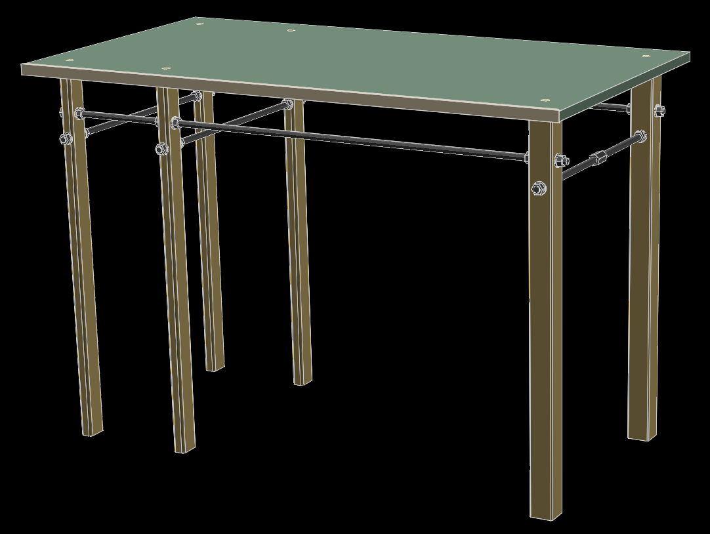

# b_nch 

## Who?

Something bench-like from scrap contained within The Basement™, modelled in [SOLVESPACE](//solvespace.com).

## How?

The SOLVESPACE models are in the repo root.

An export in the form of a JS-based viewer can be found [here](//rawcdn.githack.com/nabijaczleweli/b_nch/master/exports/assembly.html).

The build process is [documented](//lfs.nabijaczleweli.xyz/0017-twitter-export#1127567692788051969) on Twitter.
